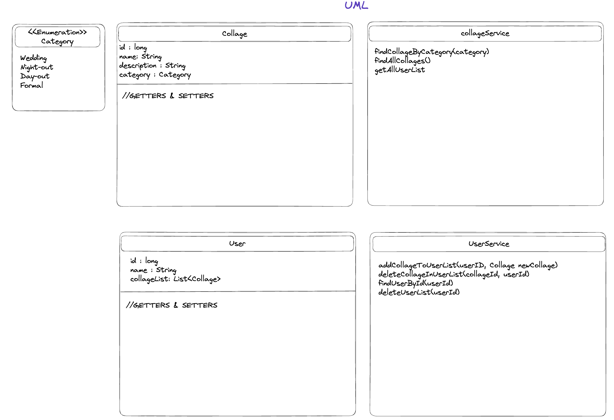
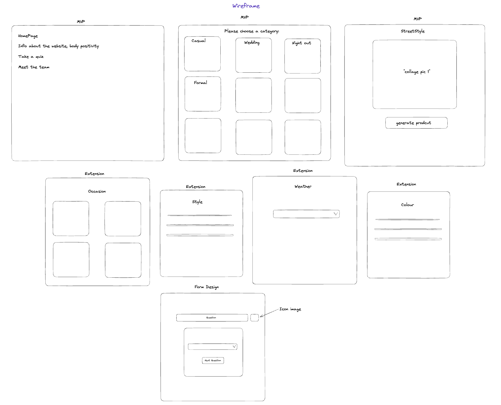

# GRWM (Get Ready with Me) Capstone Project 👗

## Collaborators

- Chinika Charles (GitHub: [ChinikaC](https://github.com/ChinikaC))
- Aya Hezam (GitHub: [aya-rh](https://github.com/aya-rh))
- Samra Afzaal (GitHub: [samra-a](https://github.com/samra-a))
- Diana Eboegbulem (GitHub: [PrincessDiana1](https://github.com/PrincessDiana1))

<hr />

## Table of Contents
1. Project Description
2. Diagrams
3. Tech Stack
4. Dependencies
5. Setup Instructions
6. RESTful Route Endpoints
7. Future Developments

<hr />

## 1. Project Description

As part of our capstone project, we had to create an API and the client-side for the API in less than two weeks. Our group decided to base our project on personalised outfit inspirations whilst also promoting body positivity, as this was something we had not seen before and we wanted to set ourselves a challenge. This ‘Get Ready with Me’ (GRWM) website is a styling platform, designed with the user in mind allowing women to embrace their individual sense of style by making chosing an outfit easy. There is a short quiz for the user to fill out and once they have done this, outfit collages will be generated using an algorithm, based on the user's answers.

<hr />

## 2. Diagrams

### UML

Our UML includes our models, enum and service layer. All of our methods are displayed here.




### ERD

Our ERD displays the many-to-many relationship that we had between the collage and user - each user could end up with many collages and each collage can be assigned to many users. As a result, we only needed one join table, the 'collageList'.


### Wireframe

Our wireframe shows what our MVP was, and a rough idea of how we intended our website to look like. We seperated the sections by MVP and extension so we could organise our time better.



### Component Diagram

Our component diagram showcases the different sections that we had in our JavaScript file. We have our main GRWMContainer, pages and components and how they link to one another.


<hr />

## 3. Tech Stack

The technologies that we used in this project include:

- Java
- Spring Boot
- PostgreSQL
- JavaScript
- React
- HTML
- CSS

<hr />

## 4. Dependencies
The depenencies that we used in our API include:

- spring-boot-starter-web
- spring-boot-devtools
- spring-boot-starter-test
- spring-boot-starter-data-jpa
- postgresql

```
<dependencies>
		<dependency>
			<groupId>org.springframework.boot</groupId>
			<artifactId>spring-boot-starter-web</artifactId>
		</dependency>
		<dependency>
			<groupId>org.springframework.boot</groupId>
			<artifactId>spring-boot-devtools</artifactId>
			<scope>runtime</scope>
			<optional>true</optional>
		</dependency>
		<dependency>
			<groupId>org.springframework.boot</groupId>
			<artifactId>spring-boot-starter-test</artifactId>
			<scope>test</scope>
		</dependency>
		<dependency>
			<groupId>org.springframework.boot</groupId>
			<artifactId>spring-boot-starter-data-jpa</artifactId>
		</dependency>
		<dependency>
			<groupId>org.postgresql</groupId>
			<artifactId>postgresql</artifactId>
			<scope>runtime</scope>
		</dependency>
</dependencies>  
```
<hr />

## 5. Setup Instructions 

**Server-side API Instructions:**
1. Ensure the following are installed on your machine:
- Intellij IDEA (running with JDK 17)
- Postgres
- Postman
- Postico

2. Clone the repository from GitHub. Scroll to the top of this page and click on the green 'Code' button. Ensure SSH is selected and copy the link provided, or you can copy the link here: `git@github.com:samra-a/Capstone_Project_GRWM.git`. In your terminal, perform the following command:
`git clone git@github.com:samra-a/Capstone_Project_GRWM.git`

3. Create a new PostgreSQL database named 'grwm_capstone' anywhere in your terminal by writing this command:
`createdb grwm_capstone`

4. Via Intellij IDEA, run the 'CapstoneApplication' and make sure the API is running on port 8080.

5. To ensure the endpoints are working as expected, you can test them using Postman. All endpoints are available below in **section 6 'RESTful Route Endpoints'.**

**Client-side API Instructions:**
1. Ensure the following is installed on your machine:
- Visual Studio Code

3. Install node modules - in your terminal, perform the following command: `npm install` or `npm i`

**NOTE:** `npm install`/ `npm i` should also install react icons, react slick, and react router for you. If it does not, please follow instructions 5, 6, and 7. If it does, you can go straight to step 8.

5. Install React Icons - in your terminal, perform the following command: `npm install react-icons`

6. Install React Slick - in your terminal, perform the following command: `npm install react-slick`

7. Install React Router - in your terminal, perform the following command: `npm install react-router-dom@6`

8. Run React App - in your terminal, perform the following command: `npm start`. The App should automatically open in the browser. If it doesn't, you can manually navigate to `http://localhost:3000` using your preferred browser.

<hr />

## 6. RESTful Route Endpoints

To gain access to the API in Postman, use **`https://localhost:{port}/{endpoint}`** - the default port is **8080**. To navigate to the different sections, follow the endpoints below:

**Users:** 

**NOTE:** There are only 4 users in the dataloader.

1. **GET** `http://localhost:8080/users` - this will return all users.

2. **GET** `http://localhost:8080/users/{userId}` - this will return a specific user.

3. **POST** `http://localhost:8080/users/{userId}/collages/{collageId}` - this will add a specific collage, using it's id, to a specific user.

4. **PUT** `http://localhost:8080/users/{userId}/collage/{collageId}`- this will remove a specific collage from the user's list. When the GET request '`GET http://localhost:8080/users/{userId}`' is performed after this to retrieve a specific user, their updated list should display.

5. **DELETE** `http://localhost:8080/users/{userId}` - this will delete a user's whole list of collages.

**Collages:**

**NOTE:** There are a total of 40 collages in the dataloader.

1. **GET** `http://localhost:8080/collages` - this will retrieve all of the collages.

2. **GET** `http://localhost:8080/collages/users/{userId}` - this will retrieve a specific user's list of collages.

<hr />

## 7. Future Developments

If we had been granted additional time, we would have liked to add the following features to our project:
- Explore Tailwind features, that would increase user experience and produce a more seamless navigation.
- Implementing more algorithms and including more questions to provide a tailored styling lookbook and outfit collection for the user.
- Using JavaScriptUI, we would have implemented more interactiveness to our platform, allowing the user to create an avatar that resembles them and have the avatar try on the clothing.
- Adding a premium subscription for these additional services.

<hr />

**DISCLAIMER:** All images used in this project were for educational purposes only. No Copyright Infringement Intended.

